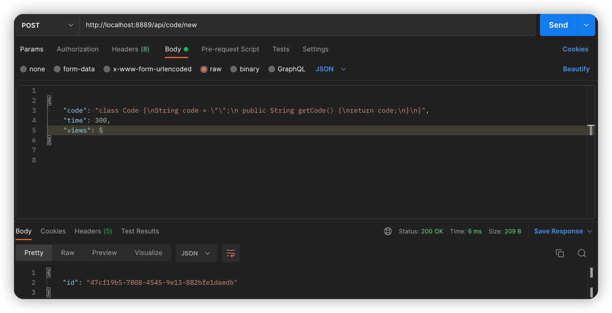
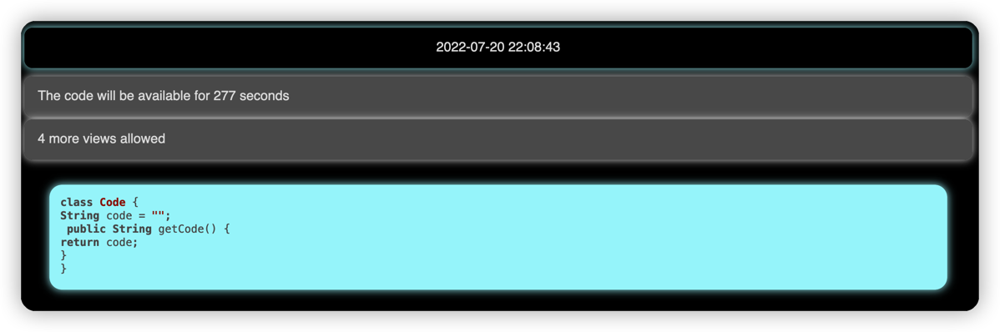
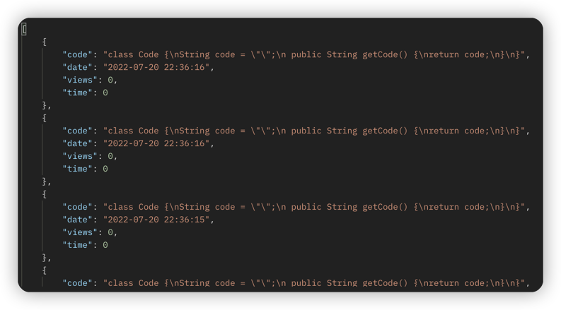
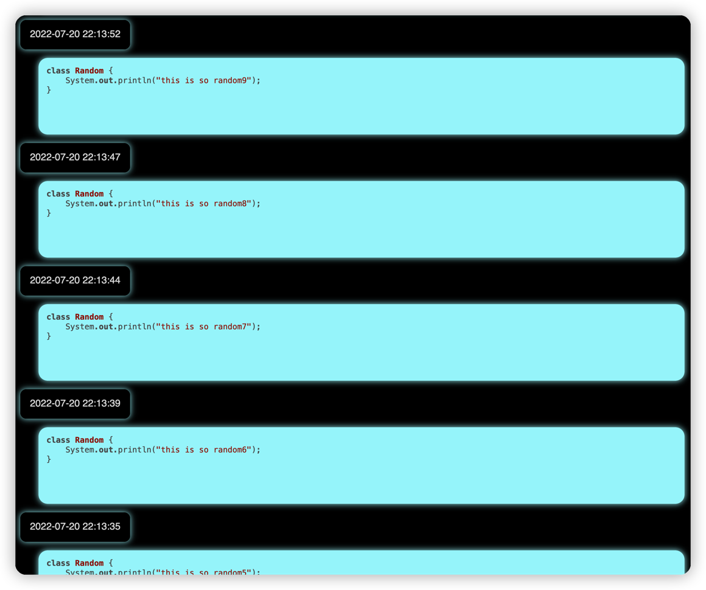
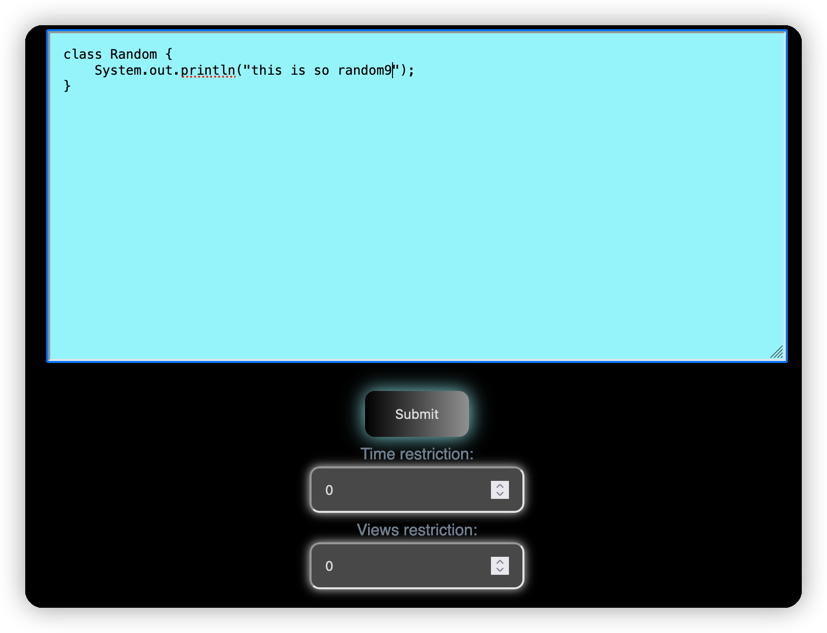
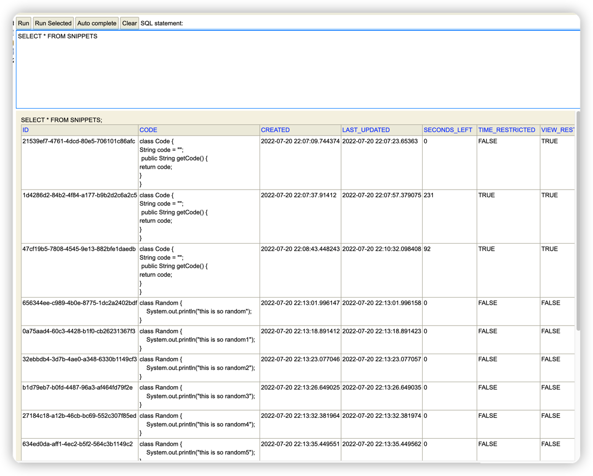

# Code-Sharing-Platform
Platform where you can share public/private code
Made with Spring Boot, Spring Data JPA, REST, H2 Database and Thymeleaf

### Add new Code Snippet
Request `POST /api/code/new`

Response:

Request: `GET /code/47cf19b5-7808-4545-9e13-882bfe1daedb`

Response:

>The views and seconds left decrease every time the code is accessed

### Check the latest snippet ordered by creation timestamp
Request: `GET /api/code/latest`

Response:

Request: `GET /code/latest`

Response:

> Only shows snippets that don't have any restrictions

### Publish new code snippet with GUI
Request: `GET /code/new`

Response:

### Access saved snippets on H2 datebase

